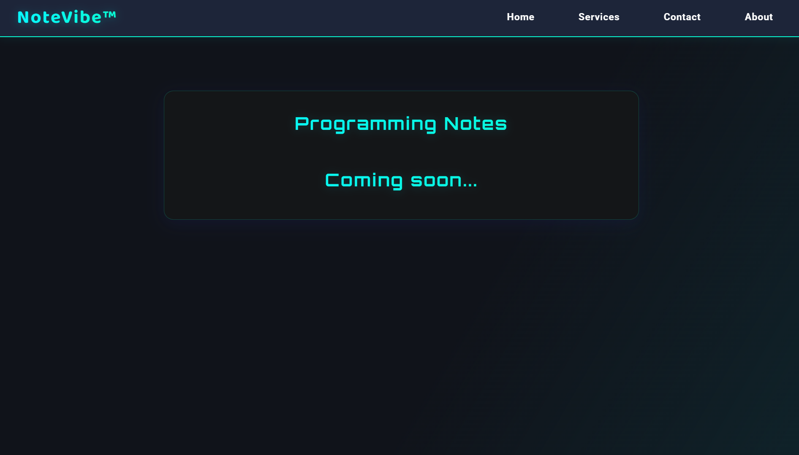
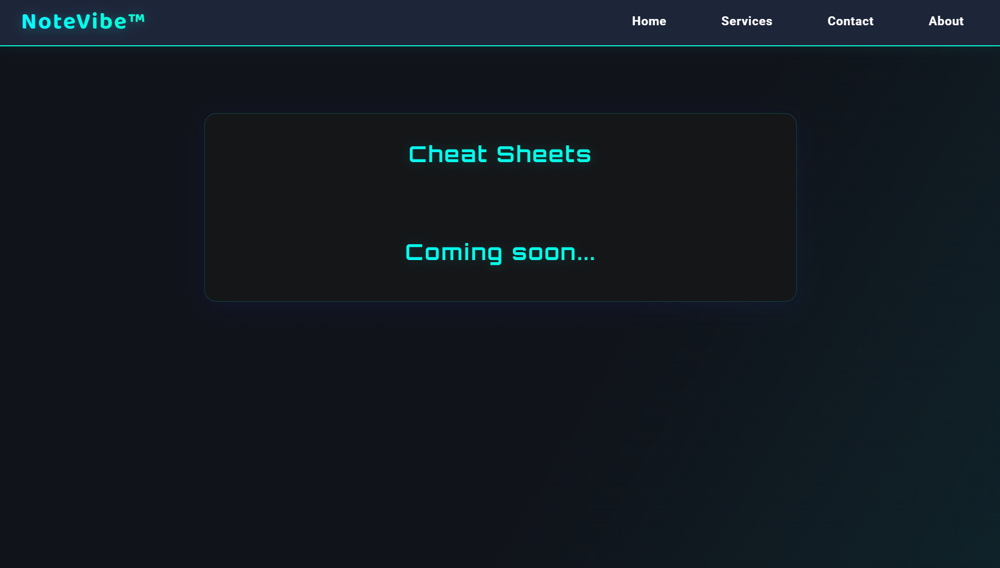
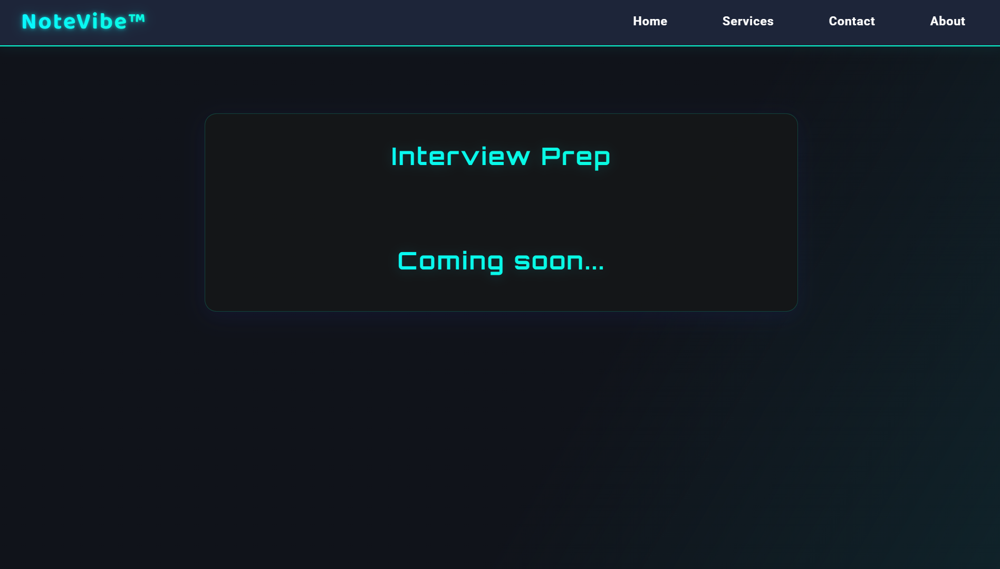
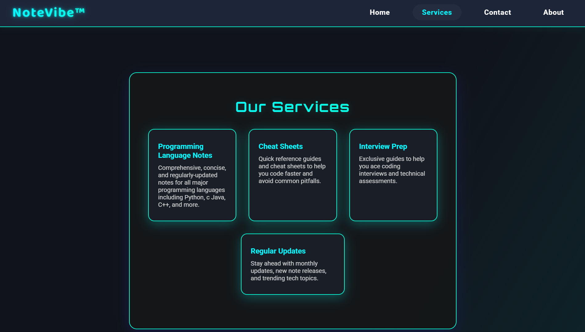
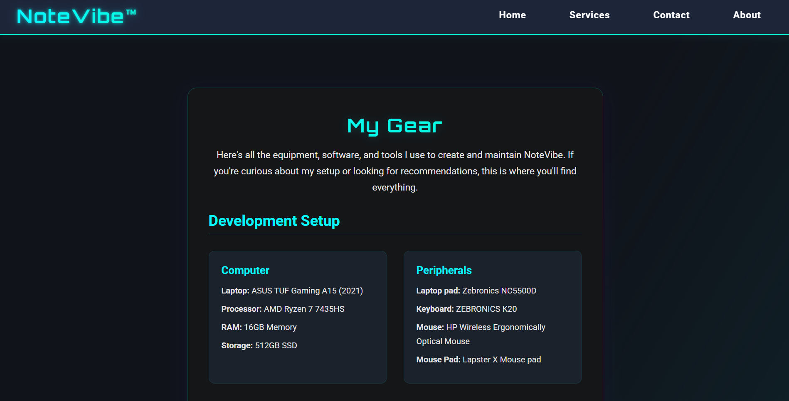
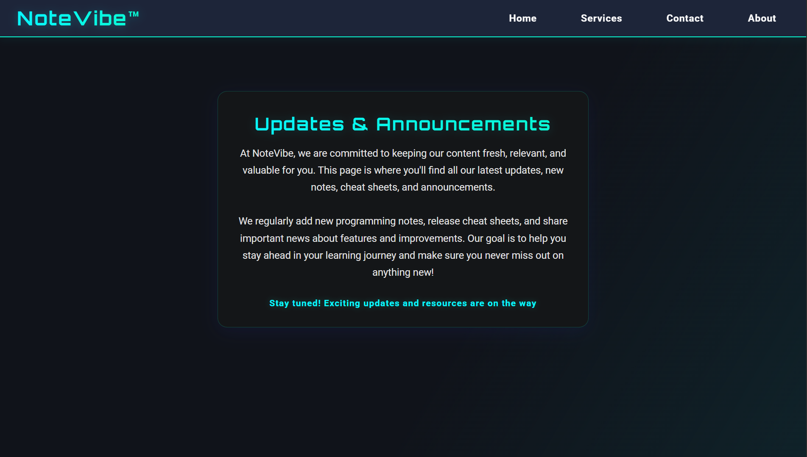
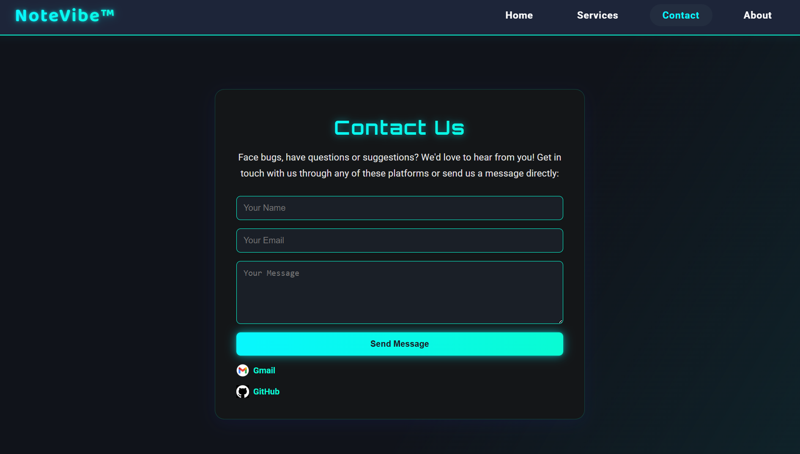
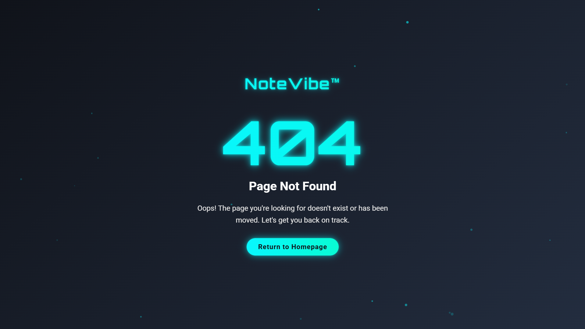

# NoteVibe – Learn, Code, Thrive (v1.0.1)


<p align="center">
  
</p>

> **NoteVibe** is a sleek, neon-themed learning hub packed with concise programming notes, printable cheatsheets, interview-prep guides, and more – all woven together with Python + Flask.  
> The public instance lives at **<https://notevibe.onrender.com>**.

---

## 📑 Table of Contents

1. [Key Features](#key-features)  
2. [Screenshots](#screenshots)  
3. [How It Works (Under the Hood)](#how-it-works-under-the-hood)  
4. [Tech Stack](#tech-stack)  
5. [Local Setup – Personal Use Only](#local-setup--personal-use-only)  
6. [Project Structure](#project-structure)  
7. [Tests](#tests)  
8. [License Summary](#license-summary)  
9. [Commercial Licensing & Contact](#commercial-licensing--contact)

---

## Key Features

| Category | Highlights |
|----------|------------|
| **Notes** | • Bite-sized explanations of core CS & Python topics<br>• Clean typography & dark-cyber aesthetic |
| **Cheatsheets** | • Printable PDFs & quick-reference tables<br>• Syntax reminders & command palettes |
| **Interview Prep** | • DSA patterns, complexity cheats, & popular questions<br>• Step-by-step solutions & strategy tips |
| **Dynamic Contact Form** | • Users can reach out – messages are relayed via Gmail SMTP in real-time |
| **PWA Flair** | • Custom favicon, manifest, and offline-friendly assets |
| **Responsive Design** | • Looks stunning on 4-inch phones all the way to ultrawides |
| **Neon Theme** | • CSS-only glassmorphism & animated gradients – zero bulky UI frameworks |

---

## Screenshots

| Page | Route | Preview |
|------|-------|---------|
| Home | `/` |  |
| Notes | `/notes` |  |
| Cheatsheets | `/cheatsheets` |  |
| Interview Prep | `/interview-prep` |  |
| Services | `/services` |  |
| My Gear | `/my-gear` |  |
| Updates | `/updates` |  |
| Contact | `/contact` |  |
| 404 Error | N/A |  |

> *All screenshots are shipped in */static/images/* so you can open them directly if the table preview cuts them off.*

---

## How It Works (Under the Hood)

```mermaid
flowchart TD
    subgraph Browser
        A[User] -- HTTP/HTTPS --> B(Flask Server)
    end
    subgraph Server
        B -- Jinja2 render --> C{Template}
        B -- SMTP --> D[Gmail]
        C --> E[HTML/CSS/JS]
    end
    A <-- 200 OK -- E
```

1. **Routing** – `app.py` registers a route for every page (`/notes`, `/cheatsheets`, etc.).  
2. **Template Rendering** – Each route returns a Jinja2 template from */templates/*.  
3. **Contact Workflow** – The form posts to `/contact`, the server validates data, then uses Gmail SMTP to shoot an email straight to the owner's inbox.  
4. **Styling** – All UI/UX magic lives in `static/css/main.css` + minimal in-page `<style>` blocks.  
5. **Assets** – Images & icons live under `static/images/`; no external CDNs aside from Google Fonts.

---

## Tech Stack

| Layer | Tooling |
|-------|---------|
| **Backend** | Python 3.11, Flask 3.1 (Jinja2, Werkzeug) |
| **Frontend** | HTML5, CSS3 (Flexbox + Grid, glassmorphism), vanilla JS |
| **Email** | Gmail SMTP via `smtplib` + `email.mime` |
| **Dev Tooling** | python-dotenv, PowerShell scripts, `venv`, `pip` |
| **Prod Server** | Gunicorn (not committed, but recommended) |
| **Testing** | `test_contact.py` – tiny smoke-suite to ensure env vars & contact route work |

---

## Local Setup – Personal Use Only

```bash
# 1. Clone the repo
$ git clone https://github.com/YourUser/NoteVibe.git && cd NoteVibe

# 2. (Optional) Create & activate a virtual env
$ python -m venv .venv && source .venv/Scripts/activate  # PowerShell

# 3. Install Python dependencies
$ pip install -r requirements.txt

# 4. Add your secrets to a .env file (Gmail App Password recommended)
EMAIL_ADDRESS=your-gmail@example.com
EMAIL_PASSWORD=your-16-char-app-password
APP_SECRET_KEY=random-super-secret

# 5. Fire up the development server
$ python app.py

# 6. Visit
http://localhost:5000
```

> **Important ⚠️** – Cloning the repo does **not** grant you the right to deploy it publicly. See [License Summary](#license-summary).

---

## Project Structure

```text
NoteVibe/
├── app.py               # Main Flask application (routes, email, error handling)
├── templates/           # Jinja2 HTML templates (one per route)
├── static/
│   ├── css/
│   │   └── main.css     # Central stylesheet
│   ├── images/          # Screenshots, favicon, og-images
│   └── js/
│       └── main.js      # (Placeholder for deferred scripts)
├── requirements.txt     # Locked Python dependencies
├── LICENSE              # Proprietary license document
├── README.md            # You're reading it ✔
├── structure.txt        # Human-readable project map
└── test_contact.py      # CLI smoke tests (imports, env vars, contact route)
```

---

## Tests

Run the built-in contact smoke test:

```bash
$ python test_contact.py
```

You should see green check-marks for imports, env vars, and route discovery before deploying.

---

## License Summary

This codebase is protected by the **NoteVibe Proprietary License** (see full text in [`LICENSE`](LICENSE)).

• You may **read** the code and reuse *up to 10 lines* in educational material **with attribution**.  
• **Deployment, redistribution, or commercial use** requires a paid license (monthly or lifetime).  
• Unauthorized public hosting may trigger DMCA takedowns or legal action.

---

## Commercial Licensing & Contact

Interested in using NoteVibe on a public server, in client work, or in a commercial course?

📧 **pandeykartikeya313@gmail.com**  
Licenses are flexible – let's chat.

---

<div align="center">
Made with ❤️ in India • © 2025 Kartikeya Pandey
</div>
