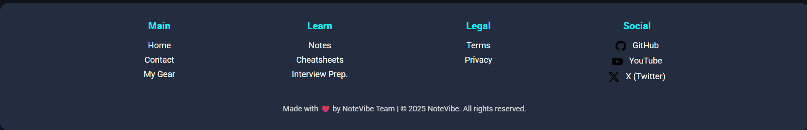
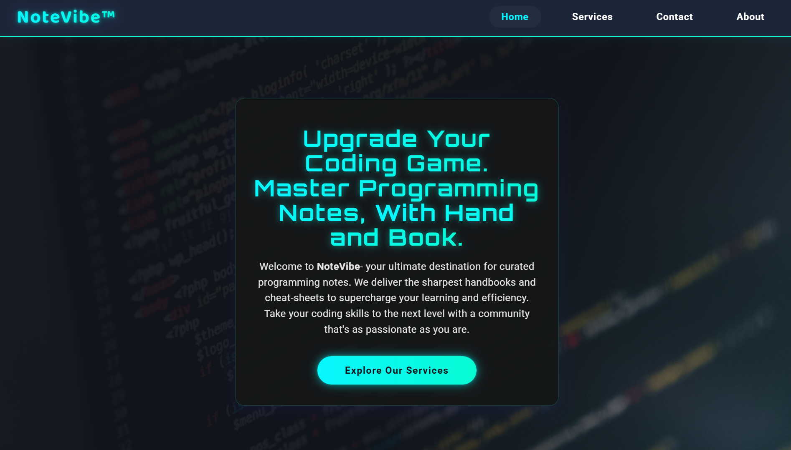

# 🎵 NoteVibe – Where Coders Catch the Vibe (v1.0.1)

<div align="center">


<p align="center">
  
</p>

> **🎯 NoteVibe** is a sleek, neon-themed learning hub packed with concise programming notes, printable cheatsheets, interview-prep guides, and more – all woven together with **Python + Flask**.  
> The public instance lives at **🌐 <https://notevibe.onrender.com>**.

[🚀 Live Demo](https://notevibe.onrender.com) • [📧 Contact](mailto:pandeykartikeya313@gmail.com) • [📄 License](LICENSE)

</div>

---

## 📑 Table of Contents

1. [✨ Key Features](#-key-features)  
2. [🎨 UI Components](#-ui-components)  
3. [📸 Screenshots](#-screenshots)  
4. [⚙️ How It Works (Under the Hood)](#️-how-it-works-under-the-hood)  
5. [🛠️ Tech Stack](#️-tech-stack)  
6. [🚀 Local Setup – Personal Use Only](#-local-setup--personal-use-only)  
7. [📁 Project Structure](#-project-structure)  
8. [🧪 Tests](#-tests)  
9. [📋 License Summary](#-license-summary)  
10. [💼 Commercial Licensing & Contact](#-commercial-licensing--contact)

---

## ✨ Key Features

<div align="center">

| 🎯 Category | ✨ Highlights |
|-------------|---------------|
| **📝 Notes** | • Bite-sized explanations of core CS & Python topics<br>• Clean typography & dark-cyber aesthetic<br>• 452 lines of comprehensive content |
| **📋 Cheatsheets** | • Printable PDFs & quick-reference tables<br>• Syntax reminders & command palettes<br>• 452 lines of organized references |
| **💼 Interview Prep** | • DSA patterns, complexity cheats, & popular questions<br>• Step-by-step solutions & strategy tips<br>• 395 lines of interview guidance |
| **📧 Dynamic Contact Form** | • Users can reach out – messages are relayed via Gmail SMTP in real-time<br>• 544 lines of robust form handling with validation |
| **📱 Responsive Design** | • Looks stunning on 4-inch phones all the way to ultrawides<br>• Mobile-first approach with fluid layouts |
| **🌟 Neon Theme** | • CSS-only glassmorphism & animated gradients – zero bulky UI frameworks<br>• Dark theme with vibrant neon accents |

</div>

### 🎨 Design Philosophy
- **Dark Neon Aesthetic** - Eye-friendly dark theme with vibrant neon accents
- **Glassmorphism Effects** - Modern frosted glass UI elements
- **Responsive Grid System** - Fluid layouts that adapt to any screen size
- **Performance Optimized** - Lightweight CSS with minimal JavaScript

---

## 🎨 UI Components

<div align="center">

### 🧭 Navigation Bar


### 🦶 Footer


</div>

---

## 📸 Screenshots

<div align="center">

| 📄 Page | 🛣️ Route | 🖼️ Preview |
|---------|-----------|------------|
| 🏠 Home | `/` |  |
| 📝 Notes | `/notes` |  |
| 📋 Cheatsheets | `/cheatsheets` |  |
| 💼 Interview Prep | `/interview-prep` |  |
| 🛠️ Services | `/services` |  |
| 🖥️ My Gear | `/my-gear` |  |
| 📢 Updates | `/updates` |  |
| 📧 Contact | `/contact` |  |
| ❌ 404 Error | N/A |  |

> *All screenshots are shipped in */static/images/* so you can open them directly if the table preview cuts them off.*

</div>

---

## ⚙️ How It Works (Under the Hood)

```mermaid
flowchart TD
    subgraph Browser
        A[👤 User] -- HTTP/HTTPS --> B(🐍 Flask Server)
    end
    subgraph Server
        B -- Jinja2 render --> C{📄 Template}
        B -- SMTP --> D[📧 Gmail]
        C --> E[🎨 HTML/CSS/JS]
    end
    A <-- 200 OK -- E
    
    style A fill:#e1f5fe
    style B fill:#f3e5f5
    style C fill:#e8f5e8
    style D fill:#fff3e0
    style E fill:#fce4ec
```

### 🔄 Request Flow
1. **🌐 Routing** – `app.py` registers 15+ routes for every page (`/notes`, `/cheatsheets`, etc.)  
2. **📄 Template Rendering** – Each route returns a Jinja2 template from */templates/*  
3. **📧 Contact Workflow** – The form posts to `/contact`, the server validates data, then uses Gmail SMTP to shoot an email straight to the owner's inbox  
4. **🎨 Styling** – All UI/UX magic lives in `static/css/main.css` + minimal in-page `<style>` blocks  
5. **🖼️ Assets** – Images & icons live under `static/images/`; no external CDNs aside from Google Fonts

### 🛣️ Available Routes
- `/` or `/home` - Landing page
- `/services` - Services overview
- `/notes` - Programming notes
- `/files/python-note` - Python-specific notes
- `/cheatsheets` - Quick references
- `/interview-prep` - Interview resources
- `/updates` - Site updates
- `/contact` - Contact form
- `/about` - About page
- `/my-gear` - Equipment showcase
- `/coming-soon` - Future features
- `/terms` - Terms of service
- `/privacy` - Privacy policy

---

## 🛠️ Tech Stack

<div align="center">

| 🏗️ Layer | 🛠️ Tooling | 📊 Version |
|----------|------------|-----------|
| **🐍 Backend** | Python 3.11, Flask 3.1.1 (Jinja2, Werkzeug) | Latest |
| **🎨 Frontend** | HTML5, CSS3 (Flexbox + Grid, glassmorphism), vanilla JS | Modern |
| **📧 Email** | Gmail SMTP via `smtplib` + `email.mime` | Built-in |
| **🔧 Dev Tooling** | python-dotenv 1.0.1, PowerShell scripts, `venv`, `pip` | Latest |
| **🚀 Prod Server** | Gunicorn 23.0.0 (production WSGI server) | Latest |
| **🧪 Testing** | `test_contact.py` – smoke-suite for env vars & contact route | Custom |

</div>

### 📦 Dependencies
- **Flask 3.1.1** - Modern web framework with Jinja2 templating
- **python-dotenv 1.0.1** - Environment variable management
- **gunicorn 23.0.0** - Production WSGI server
- **smtplib** - Email functionality (built-in Python library)

---

## 🚀 Local Setup – Personal Use Only

```bash
# 1. 🗂️ Clone the repo
$ git clone https://github.com/YourUser/NoteVibe.git && cd NoteVibe

# 2. 🐍 Create & activate a virtual env
$ python -m venv .venv
$ .venv\Scripts\activate  # Windows PowerShell
$ source .venv/bin/activate  # Unix/Linux

# 3. 📦 Install Python dependencies
$ pip install -r requirements.txt

# 4. 🔐 Add your secrets to a .env file (Gmail App Password recommended)
EMAIL_ADDRESS=your-gmail@example.com
EMAIL_PASSWORD=your-16-char-app-password
APP_SECRET_KEY=random-super-secret

# 5. 🚀 Fire up the development server
$ python app.py

# 6. 🌐 Visit
http://localhost:5000
```

> **⚠️ Important** – Cloning the repo does **not** grant you the right to deploy it publicly. See [License Summary](#-license-summary).

### 🔧 Environment Variables
Create a `.env` file in the root directory with:
```env
EMAIL_ADDRESS=your-gmail@gmail.com
EMAIL_PASSWORD=your-app-password
APP_SECRET_KEY=your-secret-key
```

### 🚀 Production Deployment
For production deployment, use Gunicorn:
```bash
$ gunicorn app:app
```

---

## 📁 Project Structure

```
NoteVibe/                          # 🏠 Root directory
│
├── 📱 Core Files
│   ├── app.py                     # 🐍 Main Flask app (185 lines, 15+ routes, email, logging)
│   ├── requirements.txt           # 📦 Dependencies (Flask 3.1.1, gunicorn 23.0.0, dotenv 1.0.1)
│   ├── test_contact.py            # 🧪 Contact form testing (94 lines)
│   └── structure.txt              # 📋 Project structure documentation
│
├── 📚 Docs
│   ├── README.md                  # 📖 Project guide & setup (179 lines)
│   └── LICENSE                    # ⚖️ Proprietary license (86 lines)
│
├── ⚙️ Config
│   ├── .gitattributes             # 🔧 Git settings (9 lines)
│   ├── .gitignore                 # 🚫 Ignored files (20 lines)
│   └── .env                       # 🔐 Secrets (create manually)
│
├── 🎨 Static Assets
│   └── images/                    # 🖼️ Images & screenshots
│       ├── logo.png               # 🏷️ Site logo (921KB)
│       ├── github-icon.png        # 📱 GitHub icon (5.4KB)
│       ├── gmail-icon.png         # 📧 Gmail icon (59KB)
│       ├── navbar.png             # 🧭 Navigation bar (29KB)
│       ├── footer.png             # 🦶 Footer (30KB)
│       └── 📸 Screenshots/        # 📱 Page previews
│           ├── homepage-screenshot.png
│           ├── notespage-screenshot.png
│           ├── cheatsheetspage-screenshot.png
│           ├── interview-preppage-screenshot.png
│           ├── servicespage-screenshot.png
│           ├── my-gearpage-screenshot.png
│           ├── updatespage-screenshot.png
│           ├── contactpage-screenshot.png
│           └── 404-errorpage-screenshot.png
│
├── 📄 Templates
│   ├── 🏠 Main Pages
│   │   ├── home.html              # 🏠 Landing page (769 lines)
│   │   ├── about.html             # ℹ️ About us (477 lines)
│   │   ├── services.html          # 🛠️ Services overview (588 lines)
│   │   └── contact.html           # 📧 Contact form + email (544 lines)
│   │
│   ├── 📚 Learning
│   │   ├── notes.html             # 📝 Programming notes (452 lines)
│   │   ├── cheatsheets.html       # 📋 Quick references (452 lines)
│   │   └── interview-prep.html    # 💼 Interview resources (395 lines)
│   │
│   ├── 🛠️ Utility
│   │   ├── my-gear.html           # 🖥️ Equipment showcase (464 lines)
│   │   ├── updates.html           # 📢 Changelog (403 lines)
│   │   └── coming-soon.html       # 🚧 Future features (473 lines)
│   │
│   ├── ⚖️ Legal
│   │   ├── terms.html             # 📜 Terms of service (431 lines)
│   │   └── privacy.html           # 🔒 Privacy policy (443 lines)
│   │
│   ├── 🚨 Errors
│   │   └── 404.html               # ❌ Custom error page (262 lines)
│   │
│   └── 📁 files/                  # 📂 Future downloads (empty)
│
├── 🐍 Python Cache
│   └── __pycache__/               # 🔄 Python bytecode cache
│
└── 🎯 Virtual Environment
    └── .venv/                     # 🐍 Python virtual environment
```

### 📊 File Statistics
- **Total Lines of Code**: 6,000+ lines across all templates
- **Total File Size**: ~15MB including images
- **Template Count**: 15 HTML templates
- **Image Assets**: 14 optimized images (including navbar/footer)
- **Flask Routes**: 15+ routes with full functionality
- **Email Integration**: Gmail SMTP with TLS encryption

---

## 🧪 Tests

Run the built-in contact smoke test:

```bash
$ python test_contact.py
```

You should see green check-marks for imports, env vars, and route discovery before deploying.

### 🧪 Test Coverage
- ✅ **Import Validation** - Ensures all required modules are available
- ✅ **Environment Variables** - Checks for required .env variables
- ✅ **Route Discovery** - Validates all Flask routes are properly configured
- ✅ **Email Configuration** - Tests Gmail SMTP setup

---

## 📋 License Summary

This codebase is protected by the **NoteVibe Proprietary License** (see full text in [`LICENSE`](LICENSE)).

<div align="center">

| ✅ Allowed | ❌ Restricted |
|------------|---------------|
| • Read the code for educational purposes | • Public deployment without license |
| • Reuse up to 10 lines with attribution | • Commercial redistribution |
| • Personal/local development | • Client work without permission |
| • Educational material creation | • Unauthorized hosting |

</div>

> **⚖️ Legal Notice**: Unauthorized public hosting may trigger DMCA takedowns or legal action.

---

## 💼 Commercial Licensing & Contact

Interested in using NoteVibe on a public server, in client work, or in a commercial course?

<div align="center">

### 📧 **pandeykartikeya313@gmail.com**

**🎯 License Options:**
- 💰 **Monthly License** - Flexible commercial use
- 🏆 **Lifetime License** - One-time payment
- 🎓 **Educational License** - Academic institutions
- 🤝 **Custom Licensing** - Tailored to your needs

**💡 Why License?**
- 🛡️ Legal protection for your business
- 🚀 Priority support and updates
- 📚 Access to premium features
- 🤝 Partnership opportunities

</div>

---

<div align="center">

## 🌟 Made with ❤️ in India

**© 2025 Kartikeya Pandey** • [🌐 Live Site](https://notevibe.onrender.com) • [📧 Contact](mailto:pandeykartikeya313@gmail.com)

[⬆️ Back to Top](#-notevibe--where-coders-catch-the-vibe-v101)

</div>
