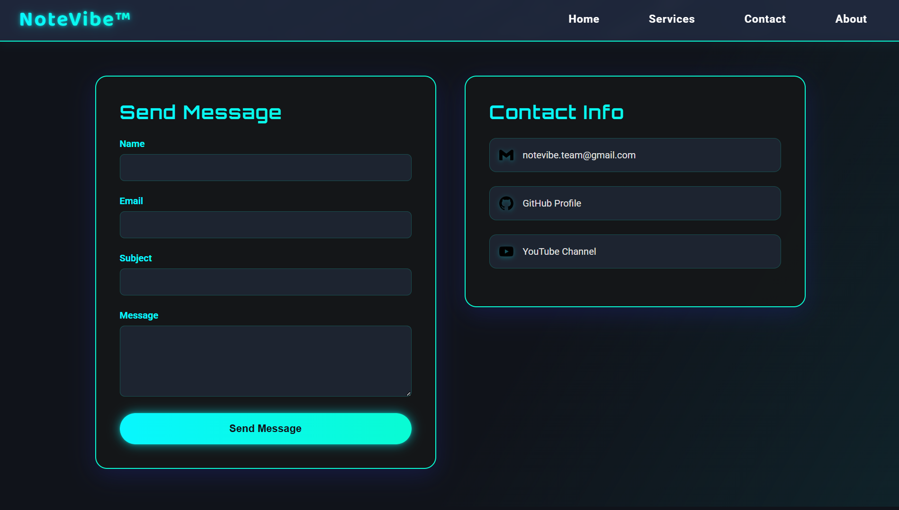

# 🎵 **NoteVibe** – _Where Coders Catch the Vibe_

<div align="center">

[](LICENSE)
[](#-tech-stack)
[](#-tech-stack)
[](https://github.com/YourUser/NoteVibe/actions)
[](#-tests)

<!-- 👉 Replace with an actual banner (1920×450 recommended) -->


</div>

> **NoteVibe** is your all-in-one, neon-themed learning hub for coders. Get bite-sized programming notes, printable cheatsheets, interview-prep guides, and more—all powered by **Python + Flask**. Modern, responsive, and ready for your next project, business, or classroom.

---

## 📚 Table of Contents

- [✨ Features](#-features)
- [🖼️ Screenshots](#-screenshots)
- [🗂️ Project Layout](#️-project-layout)
- [⚙️ Installation](#️-installation)
- [🚀 Usage](#-usage)
- [🛠️ Tech Stack](#-tech-stack)
- [🧪 Tests](#-tests)
- [🤝 Contributing](#-contributing)
- [🗺️ Roadmap & Future Work](#️-roadmap--future-work)
- [🐞 Known Issues](#-known-issues)
- [💸 Pricing & Plans](#-pricing--plans)
- [📜 License](#-license)
- [🙏 Acknowledgements](#-acknowledgements)

---

## ✨ Features

- **📝 Programming Notes**: Concise, clear explanations of core CS & Python topics.
- **📋 Cheatsheets**: Printable, syntax-first PDF cheatsheets for fast reference.
- **💼 Interview Prep**: Curated DSA patterns, walkthroughs, and strategy tips.
- **📧 Dynamic Contact Form**: Secure, real-time messaging via Gmail SMTP.
- **🧑‍💻 User Auth**: Register, login, and manage your account.
- **📱 Responsive Design**: Looks stunning on any device, from phones to ultrawides.
- **🌟 Dark Neon Theme**: Modern glassmorphism, animated gradients, and a cyber-cool vibe.
- **⚡ Fast & Lightweight**: Minimal JS, optimized for speed.
- **🔒 Secure**: Environment-based secrets, email validation, and more.
- **🖼️ Visual Clarity**: Every major page previewed below for full transparency.

---

## 🖼️ Screenshots

| Page | Route | Preview |
|------|-------|---------|
| **Home** | `/` |  |
| **Notes** | `/notes` |  |
| **Cheatsheets** | `/cheatsheets` |  |
| **Interview Prep** | `/interview-prep` |  |
| **Services** | `/services` |  |
| **My Gear** | `/my-gear` |  |
| **Updates** | `/updates` |  |
| **Contact** | `/contact` |  |
| **About** | `/about` |  |
| **404 Error** | (auto) |  |
| **Navbar** | (all pages) |  |
| **Footer** | (all pages) |  |

> _All screenshots are in `/static/images/` for your review._

---

## 🗂️ Project Layout

<details>
<summary>Click to expand</summary>

```text
NoteVibe/
│
├── app.py                # 237 LOC – Main Flask factory & 15+ routes
├── extensions.py         #  13 LOC – SQLAlchemy, Migrate, LoginManager singletons
├── models.py             #  40 LOC – User & UserActivity ORM models
├── requirements.txt      #  13 LOC – Python dependencies
├── test_contact.py       #  95 LOC – Smoke tests for contact workflow
│
├── auth/
│   └── __init__.py       #  89 LOC – Auth blueprint (register/login/logout)
│
├── templates/            # Jinja2 templates (HTML)
│   ├── 404.html          # 262 LOC – Custom error page
│   ├── about.html        # 477 LOC – About us
│   ├── ...               # 10+ more templates (home, notes, cheatsheets…)
│   └── files/            # Reserved for downloadable assets
│
├── static/
│   └── images/           # Logos, screenshots & UI sprites
│       └── *.png         # Optimised PNGs used across README & site
│
├── instance/             # (git-ignored) SQLite DB & runtime files
├── .github/              # CI, issue templates _(add your workflow)_
├── .gitignore            # Git exclusions
└── LICENSE               # Proprietary license text
```

</details>

> **Total Lines of Code:** ≈6,500 (HTML ≈6,000, Python ≈500). LOCs calculated with [`cloc`](https://github.com/AlDanial/cloc).

---

## ⚙️ Installation

Make sure you have **Python ≥ 3.11** and **pip** available.

```bash
# 1) Clone the repository
$ git clone https://github.com/YourUser/NoteVibe.git && cd NoteVibe

# 2) Create a virtual environment (recommended)
$ python -m venv .venv
$ source .venv/bin/activate   # Windows: .venv\Scripts\activate

# 3) Install dependencies
$ pip install -r requirements.txt

# 4) Configure environment variables
$ cp .env.example .env  # or create one manually
$ nano .env             # add EMAIL_ADDRESS, EMAIL_PASSWORD, APP_SECRET_KEY

# 5) Run the development server
$ python app.py

# ➜ Visit http://localhost:5000
```

> **Note:** Cloning this repository does **not** grant you the right to deploy it publicly or commercially. See [License](#-license) and [Pricing & Plans](#-pricing--plans).

### Production

```bash
# Use Gunicorn behind Nginx / Caddy (sample)
$ gunicorn app:create_app --bind 0.0.0.0:8000 --workers 4 --preload
```

---

## 🚀 Usage

| Command          | Description                               |
|------------------|-------------------------------------------|
| `python app.py`  | Start the built-in Flask dev server.      |
| `pytest`         | Run the smoke tests.                      |
| `cloc .`         | Generate fresh LOC statistics.            |

Once running, navigate to:

- `/` – Home
- `/notes` – Programming notes
- `/cheatsheets` – Cheatsheets hub
- `/interview-prep` – Interview resources
- `/contact` – Contact form

---

## 🛠️ Tech Stack

| Layer      | Tech |
|------------|------|
| **Backend** | 🐍 **Python 3.11**, ⚗️ **Flask 3.1.1**, ☁️ Gunicorn |
| **Database** | 🐘 SQLite (dev) / _bring your own_ Postgres |
| **Auth** | 🔑 Flask-Login, 🗄️ SQLAlchemy |
| **Frontend** | 💅 HTML5, 🎨 CSS3 (Flexbox & Grid), ✨ Vanilla JS |
| **Email** | 📧 Gmail SMTP via `smtplib` |
| **Dev Tools** | 🧪 pytest, 🌳 dotenv, 🐚 PowerShell/Bash |

> Logos provided by [Simple Icons](https://simpleicons.org/).

---

## 🧪 Tests

```bash
$ python test_contact.py   # quick smoke test
```

The script checks:

1. Python module imports
2. Environment variables presence
3. Flask app import & `/contact` route discovery

---

## 🤝 Contributing

> **First get a license!** Without a valid license, any attempt to deploy or contribute may result in legal action.

1. **Fork** the project & create your feature branch
   ```bash
   git checkout -b feat/amazing-feature
   ```
2. **Commit** with conventional commits
   ```bash
   git commit -m "feat: add amazing feature"
   ```
3. **Push** and open a **Pull Request** – please fill out the PR template.

### Code Style

- **Python** – PEP 8 + `black` (120 cols)
- **HTML/CSS** – 2-space indent, semantic tags, BEM naming
- All new Python must include **type hints & docstrings**.

> **Good first issues** are labelled `help-wanted`.

---

## 🗺️ Roadmap & Future Work

- [ ] **Internationalisation (i18n)** – EN → ES/FR/DE
- [ ] **Search bar** with fuzzy matching across notes
- [ ] **Dark-mode toggle** (currently always-on neon)
- [ ] **Dockerfile** & Compose for one-command deploys
- [ ] **Switch to Postgres** in prod + Alembic migrations

---

## 🐞 Known Issues

- First-time SMTP auth may fail if Gmail marks the login as suspicious.
- Large image assets slightly slow initial load on 3G connections.
- No CSRF protection on the contact form – _patch pending_.

Please search existing issues before opening a new one.

---

# 💸 Pricing & Plans

## Why NoteVibe is the Smartest Investment for You 🛒

- **All-in-one**: Notes, cheatsheets, interview prep, and more—no extra plugins needed.
- **Lightning Fast**: Loads in a flash, even on slow networks.
- **Mobile-Ready**: Looks stunning on any device.
- **Secure**: Your data, your rules—no third-party tracking.
- **Support That Cares**: Email us, and we'll get back within 1–2 days. Always.
- **No Hidden Fees**: What you see is what you pay.
- **Flexible Ownership**: Buy just the code, or get a full setup with your domain—your choice!

---

## 🏷️ Choose Your Plan – _Pay Only for What You Need!_

| Plan Name | What You Get | Monthly | Yearly | One-Time | With Domain Setup | Code-Only |
|-----------|--------------|---------|--------|----------|-------------------|-----------|
| **Starter** | - Read the code<br>- Run locally for learning<br>- _No public/commercial deployment_ | **FREE** | **FREE** | N/A | N/A | ✅ |
| **Pro** | - Deploy on **1 domain**<br>- All features unlocked<br>- Priority email support<br>- **Lifetime updates**<br>- _Perfect for freelancers & small teams_ | **$4.99**<br>_Cancellable anytime!_ <br>_On Render_| **$49**<br>_Best value!_ | **$99**<br>_Pay once, use forever!_ | ✅<br>_Includes code enhancement & domain setup!_ | ✅ |
| **Business** | - Up to **5 domains**<br>- Premium support<br>- White-label<br>- Priority feature requests<br>- **Lifetime access**<br>- _For agencies & startups_ | **$14.99** | **$149** | **$399** | ✅<br>_Custom branding, domain setup & onboarding!_ | ✅ |
| **Educational** | - For schools, teachers, students<br>- All features<br>- Single domain<br>- Proof required<br>- **Lifetime updates** | **$2.99** | **$29** | **$59** | ✅<br>_Onboarding & priority support!_ | ✅ |
| **Enterprise** | - Unlimited domains<br>- SLA<br>- Custom features<br>- Dedicated onboarding<br>- _Let's build your dream platform!_ | <span style="color:gray">Contact Us</span> | <span style="color:gray">Contact Us</span> | <span style="color:gray">Contact Us</span> | ✅ | ✅ |

---

### 🎁 **One-Time Plan Perks**
- We'll enhance the code for your needs—just ask!
- Free domain setup and deployment help.
- Custom features? We'll build them for you.
- Lifetime updates and priority support.

### 💡 **Custom Plan?**
Want something unique? [Contact us](mailto:pandeykartikeya313@gmail.com) and we'll make it happen—fast.

> _This price is not final. Price may differ after [contact](mailto:pandeykartikeya313@gmail.com)._

---

## 📜 License

NoteVibe is licensed under the **NoteVibe Proprietary License**. You may browse the source for personal education, but _public or commercial deployment requires a paid license_. See [`LICENSE`](LICENSE) for full terms.

> Unauthorized public deployment may result in DMCA takedown or legal action.

---

## 🙏 Acknowledgements

- **Flask** & its amazing community
- **Bootstrap Icons** & **Simple Icons** for graphics
- Everyone who has sent feedback or PRs – _you rock!_

---

<div align="center">
  Made with ❤️ in India • © 2025 Kartikeya Pandey<br/>
  <a href="#🎵-notevibe-–-where-coders-catch-the-vibe">⬆️ Back to top</a>
</div>


