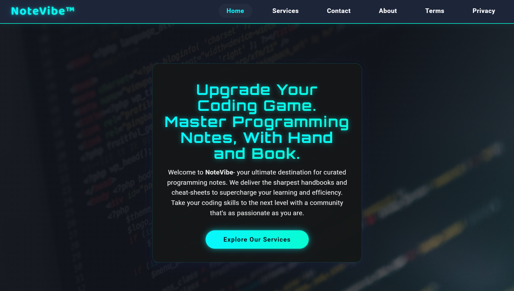

# NoteVibe

<!--
╔═════════════════════════════════════════════════════════╗
║                    N O T E V I B E                     ║
║   A Beautiful Programming Knowledge & Notes Platform   ║
╚═════════════════════════════════════════════════════════╝

Author: NoteVibe Team
Owner:  Kartikeya Pandey
Description: NoteVibe is a Flask-powered knowledge hub offering concise programming notes, cheat-sheets, and interview-prep resources. This README walks you through installation, structure, and contribution guidelines.
-->


**Author:** NoteVibe Team  
**Owner:** Kartikeya Pandey

A modern Flask web application providing programming resources, notes, cheatsheets, interview prep, and more. Built for learners and developers who want concise, high-quality study material and a smooth user experience.

## Screenshots



---

## 🚧 Project Status
**NoteVibe is currently under development.** You may encounter minor issues or unfinished features. If you find a bug or have suggestions, please [contact us](mailto:pandeykartikeya313@gmail.com) — your feedback is invaluable as we continue to grow and improve.

---

## Features
- Programming notes for Python, C, C++, Java, and more
- Cheatsheets for quick reference
- Interview prep resources
- Responsive, modern UI
- Regular updates and new content
- Contact and feedback system

---

## Requirements
All dependencies are listed in `requirements.txt` (see below for the latest update).

---

## Setup & Usage
1. Clone the repository
2. Install dependencies: `pip install -r requirements.txt`
3. Set up email functionality (optional):
   - Create a `.env` file in the project root
   - Add your Gmail credentials:
     ```
     EMAIL_ADDRESS=your-email@gmail.com
     EMAIL_PASSWORD=your-app-password
     APP_SECRET_KEY=your-secret-key-here
     ```
   - For Gmail, use an App Password (not your regular password)
   - Enable 2-factor authentication and generate an App Password
4. Run the app: `python app.py`
5. Open your browser at `http://localhost:5000`

## Contact Form & Email Setup
The contact form sends emails to `pandeykartikeya313@gmail.com` when users submit messages. To enable this functionality:

1. **Gmail Setup:**
   - Enable 2-factor authentication on your Gmail account
   - Generate an App Password (Google Account → Security → App Passwords)
   - Use the App Password in your `.env` file (not your regular password)

2. **Environment Variables:**
   - `EMAIL_ADDRESS`: Your Gmail address
   - `EMAIL_PASSWORD`: Your Gmail App Password
   - `APP_SECRET_KEY`: A random string for Flask sessions

3. **Email Format:**
   The contact form sends emails with this format:
   ```
   Name: [user's name]
   Email: [user's email]
   Message:
   [user's message]
   ```

4. **Security:**
   - Never commit your `.env` file to version control
   - The `.env` file is already in `.gitignore`
   - Use App Passwords for production security

---

## Project Structure
See `structure.txt` for a detailed breakdown of all files and their purposes.
- Each page (home, about, notes, etc.) is a dedicated Jinja2 template.

---

## Contributing
Pull requests and suggestions are welcome! Please open an issue or contact us directly.

---

## License
See [LICENSE](LICENSE) for details.

---

## Contact
- Github: [KartikeyaPandey313](https://github.com/KartikeyaPandey313/)
- Youtube: [Kartikeya ×͜×](https://www.youtube.com/channel/UCWHtM18q0CunDmvllpiRvDw)

---

## ✨ Features
- Beautiful, modern UI with responsive design
- Home, About, Services, Notes, Cheatsheets, Interview Prep, Updates, Contact, My Gear, and Coming Soon pages
- Custom 404 error page
- Organized project structure with Jinja2 templates and static assets
- Easy to extend and customize for your own needs
- All navigation uses Flask's `url_for` for robust routing
- Smooth dropdown animation for Services tab on all pages
- Social links (GitHub, YouTube) open in a new tab
- **Contact form with email functionality**

---

## 🗂️ Project Structure
See [`structure.txt`](structure.txt) for a detailed, commented overview of all files and folders.

---

## 🖼️ Logo
The project logo is included in `static/images/logo.png` and used in the navbar and documentation. To use it in your own templates:
```html

```

---

## 📁 Key Files
- `app.py` — Main Flask app, all routes and backend logic
- `requirements.txt` — Python dependencies (`flask`, `gunicorn`, `python-dotenv`)
- `structure.txt` — Full project structure with comments
- `templates/` — All HTML templates (see structure.txt for details)
- `static/images/` — All image assets (logo, icons)

---

## 🤝 Contributing
Pull requests and suggestions are welcome! Please open an issue or contact the author for major changes or collaborations.

---

## 📜 License
This project is licensed under a custom license (see [LICENSE](LICENSE) file). **Personal and educational use only.** For commercial use or redistribution, contact the author.

---

**Author:** Kartikeya Pandey / NoteVibe Team  
Contact: [pandeykartikeya313@gmail.com](mailto:pandeykartikeya313@gmail.com)

---

## How to Add More Dependencies or Documentation Details

- To add more Python dependencies, add them to requirements.txt (one per line).
- If you add new features that require extra packages, always update requirements.txt.
- To enhance documentation, you can:
    - Add more setup or deployment instructions
    - Add screenshots or demo links (see above)
    - Add API documentation, contribution guidelines, or bug reporting instructions
    - Expand file/folder descriptions in structure.txt if you add new files